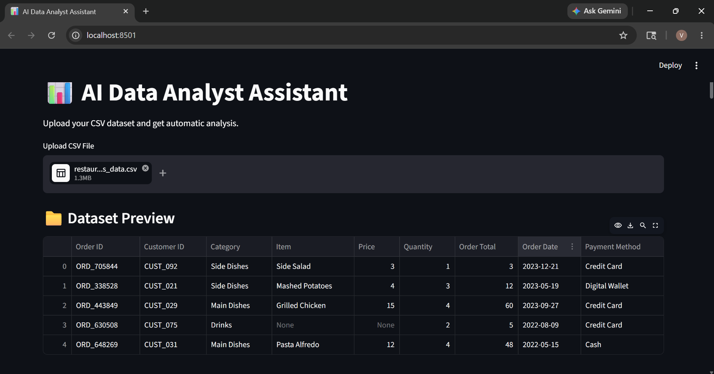
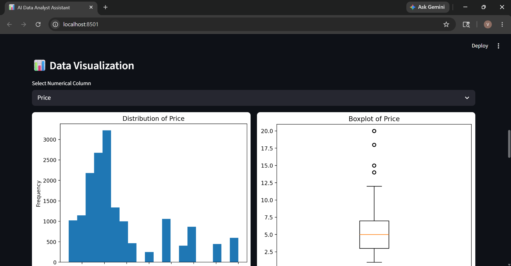
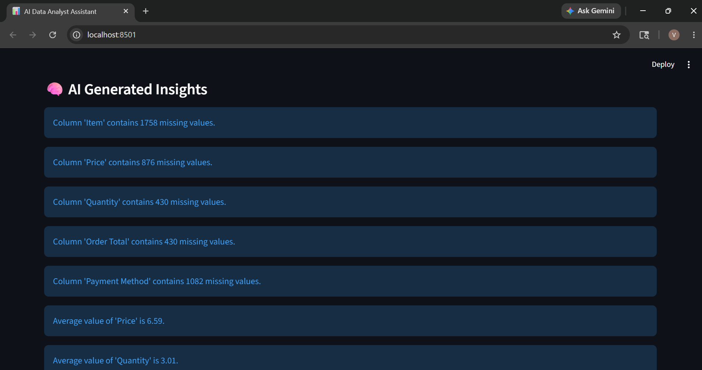
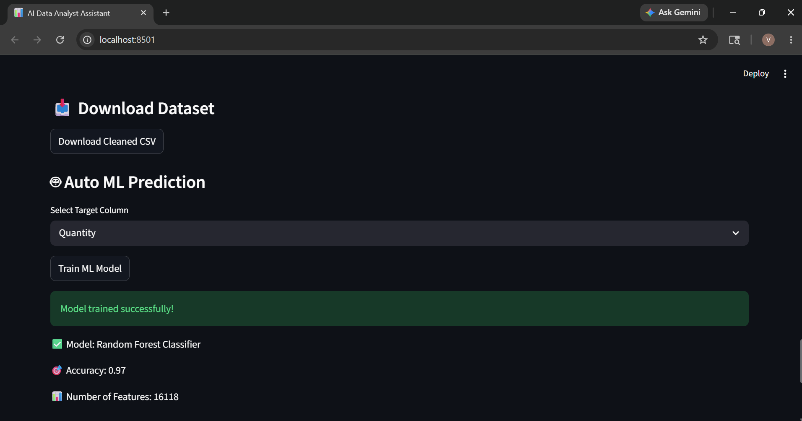
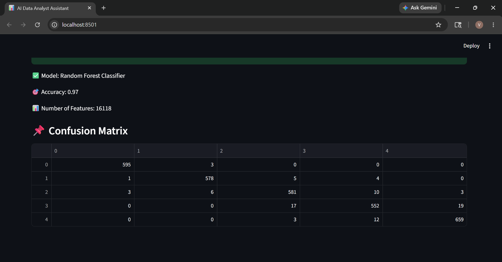

# 📊 AI Data Analyst Assistant

AI Data Analyst Assistant is a Streamlit-based machine learning and data analysis web application that helps users quickly analyze datasets, clean data, visualize patterns, and train ML models automatically.

The goal of this project was to build an interactive platform that simplifies basic data analysis workflows and makes dataset understanding easier for beginners and analysts.

---
# Live Demo :
  click : https://ai-data-analyst-skv5nuskpzdpdhahaggrcf.streamlit.app/

# 🚀 Features

- Upload CSV datasets
- Dataset preview and overview
- Missing value analysis
- Missing value handling
- Duplicate row removal
- Statistical summary
- Interactive visualizations
  - Histogram
  - Boxplot
  - Scatter Plot
  - Correlation Heatmap
- AI-generated dataset insights
- Automated ML model training
- Confusion Matrix generation
- Download cleaned dataset

---

# 🧠 ML Concepts Used

This project includes several important machine learning and data analysis concepts:

- Data Cleaning
- Exploratory Data Analysis (EDA)
- Feature Engineering
- Classification
- Train-Test Split
- Label Encoding
- Random Forest Classifier
- Model Evaluation
- Confusion Matrix

---

# 🛠 Technologies Used

- Python
- Streamlit
- Pandas
- Matplotlib
- Seaborn
- Scikit-learn

---

# 📂 Project Structure

```text
ai-data-analyst/
│
├── app.py
│
├── utils/
│   ├── cleaning.py
│   ├── visualization.py
│   ├── insights.py
│   └── ml_models.py
│
├── screenshots/
│
├── requirements.txt
│
└── README.md
```

---

# 📸 Project Screenshots

## Dashboard



---

## Data Visualization



---

## AI Insights



---

## ML Prediction Module



---

## Confusion Matrix



---

# ⚙️ Installation

Clone the repository:

```bash
git clone https://github.com/vaibhavgawali98/Ai-Data-Analyst.git
```

Move into project folder:

```bash
cd ai-data-analyst
```

Install dependencies:

```bash
pip install -r requirements.txt
```

Run the Streamlit app:

```bash
streamlit run app.py
```

---

# 🎯 What I Learned

While building this project, I improved my understanding of:

- Data preprocessing
- Streamlit app development
- Data visualization
- Machine learning workflow
- Model evaluation techniques
- Writing modular Python code

---

# 🔮 Future Improvements

Some features I plan to add in future:

- Multiple ML model selection
- Feature importance visualization
- Regression model support
- PDF report generation
- Conversational AI chatbot
- Advanced automated insights

---

# 📌 Note

This project was built mainly for learning and portfolio purposes to strengthen practical skills in machine learning, data analysis, and Streamlit development.
